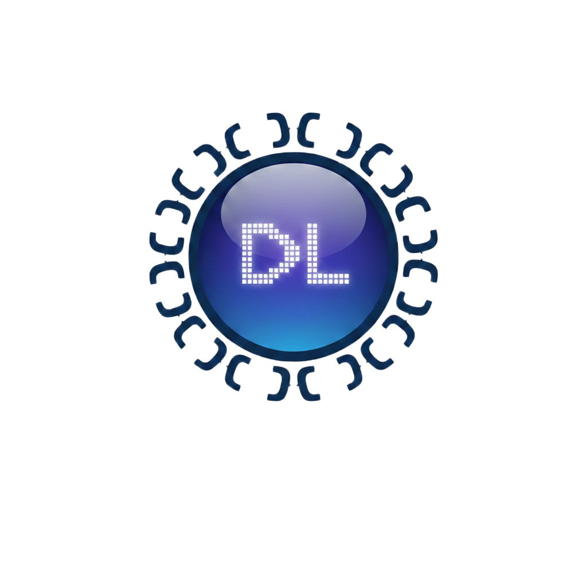

<div align="center">



# DevLens

### Instant cheat sheets for Python libraries — right next to your code.

[](#)
[](https://marketplace.visualstudio.com)
[](#license)
[](#contributing)

<br/>

[](https://marketplace.visualstudio.com)
[](https://github.com/Ali-Aldahmani/devlens/stargazers)
[](https://github.com/Ali-Aldahmani/devlens/issues)
[](https://github.com/Ali-Aldahmani/devlens/issues)

</div>

---

## ✨ What is DevLens?

**DevLens** is a VS Code extension that opens a smart cheat sheet panel **beside your code** — so you never have to leave your editor to look up a function, method, or syntax again.

Open a Python file, start typing, and DevLens **automatically detects** which library you're using and shows the most useful snippets for it. Click **Insert** to drop a snippet right at your cursor. That's it.

---

## 🚀 Features

<table>
<tr>
<td width="50%">

### 🔍 Auto-Detection
DevLens scans your imports and **automatically switches** to the right library cheat sheet as you work. Open a file with `import pandas` and it's already there.

</td>
<td width="50%">

### ⌨️ One-Click Insert
Every snippet has an **Insert** button. Click it and the code lands exactly at your cursor — no copy-pasting, no switching windows.

</td>
</tr>
<tr>
<td width="50%">

### 🔎 Instant Search
Type anything in the search box to filter across **all snippets** in the library. Find what you need in under a second.

</td>
<td width="50%">

### 🗂️ Category Tabs
Browse snippets by topic — Array Creation, Data Cleaning, Plotting, Model Evaluation, and more.

</td>
</tr>
</table>

---

## 📚 Libraries Included

| Library | Categories | Snippets |
|---|---|:---:|
| 🔢 **NumPy** | Array Creation · Info · Reshaping · Math · Sorting · Linear Algebra | ~50 |
| 🐼 **Pandas** | Creating DataFrames · Exploring · Selecting · Cleaning · Transforming · Grouping · Exporting | ~55 |
| 📊 **Matplotlib** | Basic Plots · Labels · Axes · Subplots · Styling · Saving | ~45 |
| 🎨 **Seaborn** | Distribution · Categorical · Relational · Matrix/Regression · Faceting · Themes | ~40 |
| 🤖 **Scikit-learn** | Preprocessing · Train/Test Split · Classification · Regression · Clustering · Evaluation · CV/Tuning · Pipelines | ~45 |

**Total: 235+ snippets across 5 libraries**

---

## ⌨️ Keyboard Shortcut

| OS | Shortcut |
|:---:|:---:|
| 🪟 Windows / Linux | `Ctrl + Ctrl + D` |
| 🍎 macOS | `Cmd + Ctrl + D` |

Or open via **Command Palette** → `DevLens: Open DevLens`

Or right-click inside any `.py` file → **Open DevLens**

---

## 🛠️ Getting Started (Development)

```bash
# 1. Clone the repo
git clone https://github.com/Ali-Aldahmani/devlens.git
cd devlens

# 2. Install dependencies
npm install

# 3. Compile TypeScript
npm run compile

# 4. Open in VS Code and press F5
code .
```

> Press **F5** to launch the Extension Development Host — a sandboxed VS Code window where your extension runs live.

---

## ➕ Adding More Libraries

Contributing a new library is simple:

**1.** Create `src/data/yourlib.ts` following this structure:

```ts
export const yourlib = {
  name: "YourLib",
  import: "import yourlib as yl",
  categories: [
    {
      title: "Category Name",
      items: [
        { snippet: "yourlib.method()", desc: "What it does" },
      ],
    },
  ],
};
```

**2.** Register it in `src/data/index.ts`:

```ts
import { yourlib } from "./yourlib";

export const libraries = {
  // ...existing
  yourlib,
};

export const importDetectionMap = {
  // ...existing
  "import yourlib": "yourlib",
};
```

**3.** That's it — it appears in the panel automatically! 🎉

---

## 📦 Packaging & Publishing

```bash
# Install vsce
npm install -g @vscode/vsce

# Package as .vsix (for local install / testing)
npm run package

# Publish to the VS Code Marketplace
npm run publish
```

---

## 🗺️ Roadmap

- [x] NumPy, Pandas, Matplotlib, Seaborn, Scikit-learn
- [x] Auto-detection from imports
- [x] Insert at cursor + copy to clipboard
- [x] Search and category tabs
- [x] Language selector UI (future-ready)
- [ ] More Python libraries (`os`, `re`, `datetime`, `json`, `itertools`...)
- [ ] JavaScript / TypeScript support
- [ ] Rust support
- [ ] Go support
- [ ] Favorites / pinned snippets
- [ ] User-contributed custom snippet packs

---

## 🤝 Contributing

Contributions are welcome! Whether it's a new library, a bug fix, or a feature idea.

1. Fork the repo
2. Create a branch: `git checkout -b feat/my-feature`
3. Commit your changes: `git commit -m "feat: add my feature"`
4. Push and open a Pull Request

[](https://github.com/Ali-Aldahmani/devlens/fork)

---

## 📄 License

MIT © [Ali Aldahmani](https://github.com/Ali-Aldahmani)

---

<div align="center">

Made with ❤️ for developers who hate leaving their editor

⭐ **Star this repo if DevLens saves you time!** ⭐

</div>